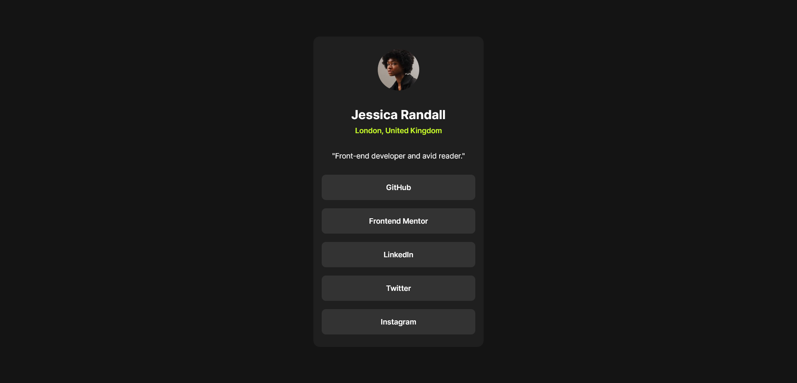

# Frontend Mentor - Social links profile solution

This is a solution to the [Social links profile challenge on Frontend Mentor](https://www.frontendmentor.io/challenges/social-links-profile-UG32l9m6dQ). Frontend Mentor challenges help you improve your coding skills by building realistic projects.

## Table of contents

- [Overview](#overview)
  - [The challenge](#the-challenge)
  - [Screenshot](#screenshot)
  - [Links](#links)
- [My process](#my-process)
  - [Built with](#built-with)
  - [What I learned](#what-i-learned)
  - [Continued development](#continued-development)
  - [Useful resources](#useful-resources)
- [Author](#author)
- [Acknowledgments](#acknowledgments)

## Overview

### The challenge

Users should be able to:

- See hover and focus states for all interactive elements on the page

### Screenshot



### Links

- [Solution](https://github.com/Sephydev/social-link-page)
- [Live Site](https://sephydev.github.io/social-link-page/)

## My process

### Built with

- Semantic HTML5 markup
- CSS custom properties
- Flexbox
- Mobile-first workflow

### What I learned

I already knew what I was doing, I learned anything. But, I will share some snippet that I found interesting:

Here is the first section of the project. The most interesting tags here is the <address> tag. It is used to show sementically different ways of contact someone, for exemple, the name or the address of Jessica :

```html
<section>
  
  <address>
    <h1>Jessica Randall</h1>
    <p>London, United Kingdom</p>
  </address>
  <p>"Front-end developer and avid reader."</p>
</section>
```

Here is how I managed to align vertically the card. I used flex on the body, I put an height to the body and finally I use align-items to center vertically the card:

```css
body {
  display: flex;
  height: 100vh;
  align-items: center;
  color: hsl(0, 0%, 100%);
  background-color: hsl(0, 0%, 8%);
  font-family: Inter, sans-serif;
}
```

### Continued development

I already know the basics of Flexbox, I know how it is useful to organize the ui element of a project. I will continue to use it on future project thanks to his usefullness but also to master it.

### Useful resources

- [CSS Tricks Flexbox Guide](https://css-tricks.com/snippets/css/a-guide-to-flexbox/) - Even if I know the basics of Flexbox, I wanted to share this ressource because it help a lot to understand Flex. It helped me multiple time before.

## Author

- Frontend Mentor - [@Sephydev](https://www.frontendmentor.io/profile/Sephydev)

## Acknowledgments

Thanks to CSS-Tricks for the creation of the Flexbox guide. It is complete and helped me a lot while learning Flex.
Thanks to Frontend Mentor for giving us challenge to complete. This help a lot mastering different technologies of our choice while reproducing beautiful design.
